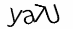
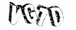
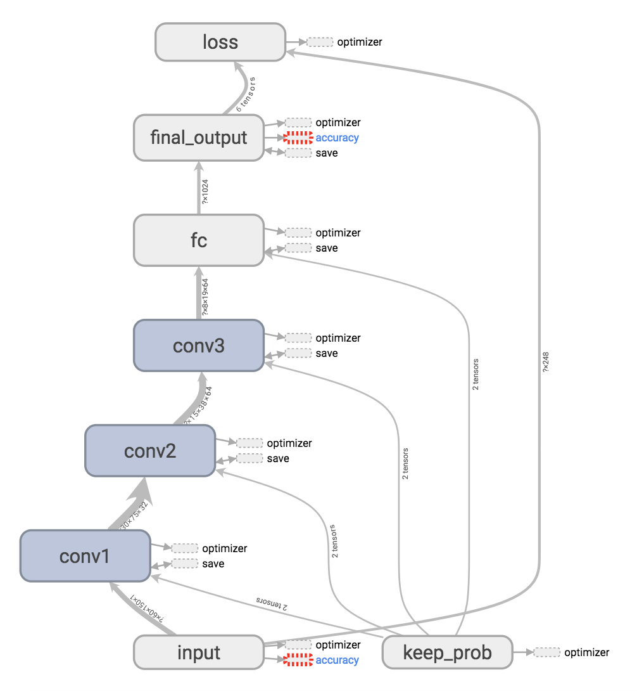
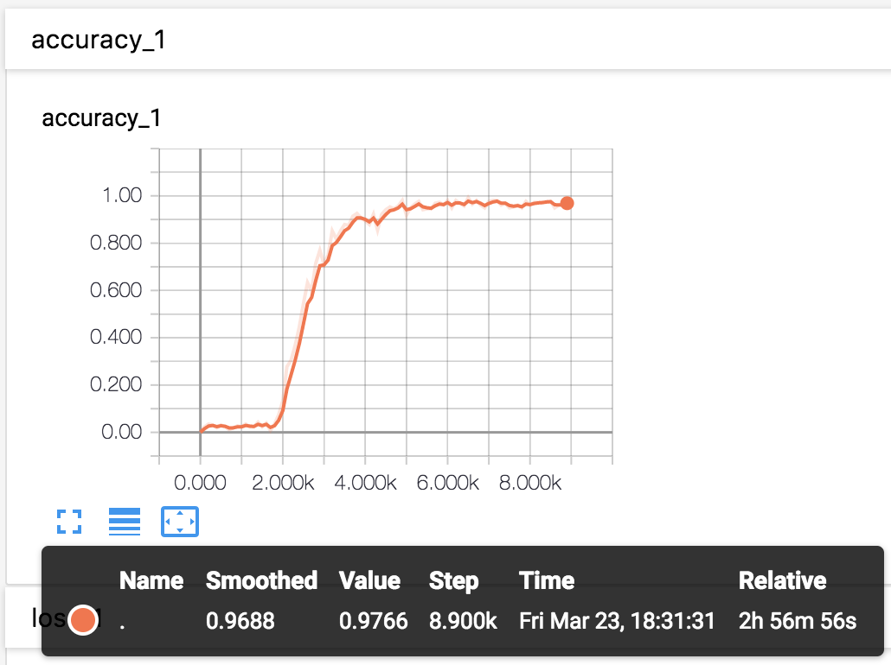
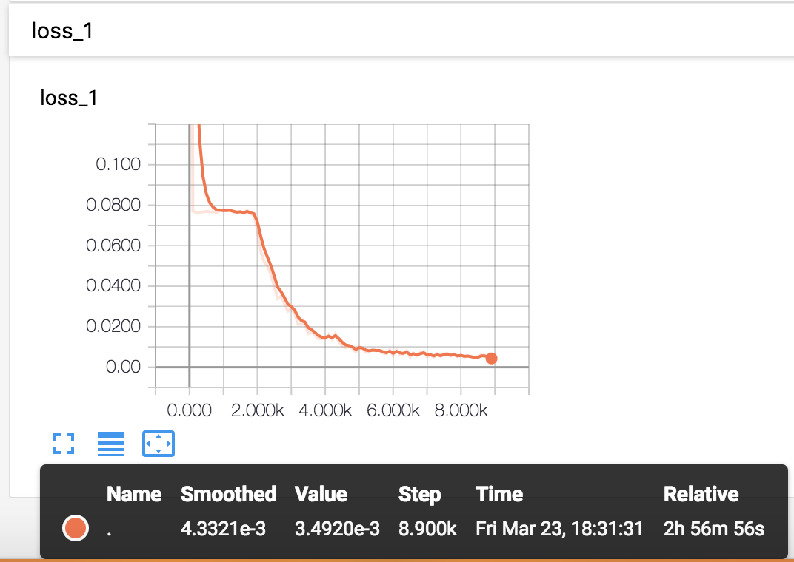

### 识别知乎验证码

最近在爬知乎的数据，遇到了验证码，就想使用TensorFlow的CNN训练一个能自动识别验证码的模型，说干就干！  

### 预备知识
1. Python3
2. PIL库和numpy库
3. TensorFlow
4. CNN(卷积神经网络)

### 分析
如果你爬过知乎，你会遇到两种验证码：细字体和粗字体。  
  
  
  
  

~~如果把两种验证码混合放到同一个神经网络中训练的话，收敛会比较慢，需要的样本量就比较大，然而我并没有很多样本，只能人工打码或者买打码服务去获取样本。所以我们可以先训练一个分类器，将两种验证码区分开，再分别去训练识别，这样需要的样本量就会少很多了！**机智如我！**~~  

**UPDATE**  
收集的样本足够多啦，就不用上面那种先分类再识别的方法啦，直接把样本丢进CNN里去训练就好！

### 如何运行
1. 把你的验证码样本放到`samples`目录下的`train_mixed_captcha_base64.txt`文件中。
3. 训练模型：运行`train`目录下的`model.py`文件，直到达到你满意的准确率，这时训练好的网络结构和权重值等会保存在checkpoints目录下。
4. 在`train`目录下的`__init__.py`中恢复训练好的模型，导出`predict_captcha`预测函数。
5. 执行`predict_captcha`函数，传入base64编码的图片字符串，执行得到预测结果。
6. :boom: Boom！想干嘛你就可以干嘛了！:smirk:

### CNN
上面几个网络模型都是类似的，都是使用TensorFlow构建了一个简单的卷积神经网络，包含一个输入层、三个卷积层+池化层和最后一个全连接层，关于CNN的具体原理大家可以Google查一查，数据科学家N多年总结出来也不是几句话能说清楚的。  
  
使用**TensorBoard**可以可视化训练的相关情况。  
  
给大家看一下我训练的网络结构：  
  
  
  
**准确率走势图**：  
  
  
  
**loss曲线**：  
  
  

  

**源码地址**：[https://github.com/lonnyzhang423/zhihu-captcha](https://github.com/lonnyzhang423/zhihu-captcha)

********
关注微信公众号：**Python实验课**，~~后台回复 **"知乎验证码"** 免费分享一份10万张标记好的验证码文件用于训练~~  
  
**UPDATE**  
资源被举报，访问不了了！自己收集样本吧！  
    
Happy Coding！  