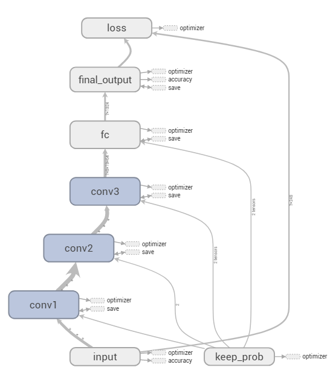
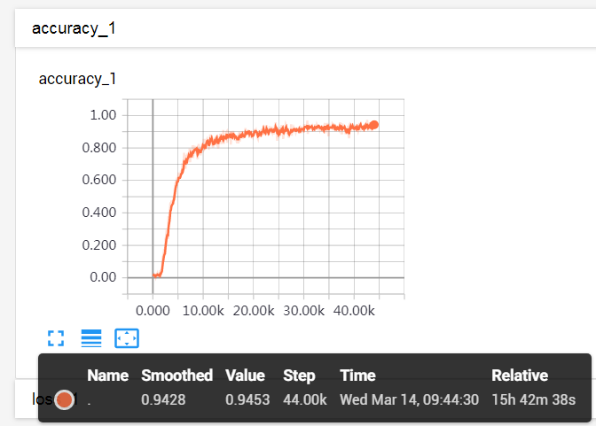
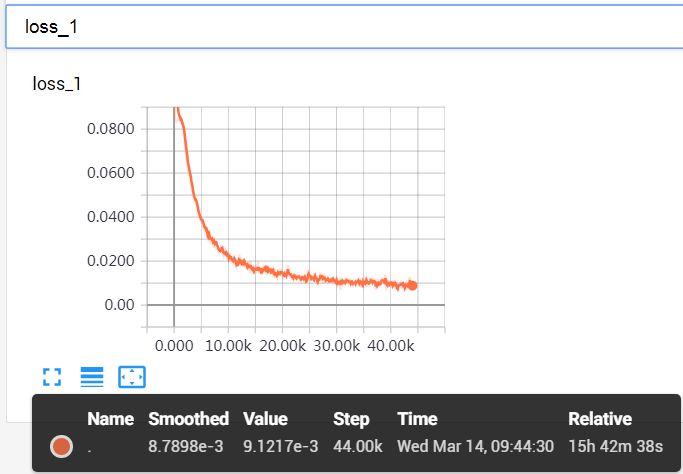

[简体中文](README.zh-cn.md)
### Zhihu-captcha
Crack zhihu captcha with TensorFlow

### Prerequisites
1. Python3
2. PIL & numpy
3. TensorFlow
4. CNN(Convolutional Neural Network)

### How to run
1. Put enough marked-captchas into [captcha_base64.txt](captcha_base64.txt) file
2. Run script [model.py](model.py), `python3 model.py`
3. Import `predict_captcha` function from `__init__.py` module, execute `predict_captcha` with image base64 str parameter, you will get a predict captcha

### Steps
1. We use Python3 and TensorFlow to build a CNN model
2. For better accuracy,mark as many as possible [zhihu captchas](https://www.zhihu.com/captcha.gif) and save to your disk
3. Then convert your marked [zhihu captcha](https://www.zhihu.com/captcha.gif) to image and label array with PIL & numpy
4. Next feed the image and label array into the prebuilt network,train the network until you are satisfied with the predict accuracy
5. Save your well trained network model
6. Restore the network model,feed the production-environment [zhihu captcha](https://www.zhihu.com/captcha.gif) and predict
7. Boom!:boom:

### CNN
We use TensorFlow to build a simple CNN which contains one input layer,three convolutional and max pooling layers and a final fully connected layer.
TensorBoard show the network graph:  
  
Buy captcha-marked service to mark enough captchas,then feed into the prebuilt network,train it until you satisfied with the accuracy.  
I run about 15 hours and get 95% accuracy:  
  
And the loss trend:  
  

***
Follow my WeChat official account: **Python实验课**，and send **"知乎验证码"** to me,I will share you a file contains 100 thousand marked-captchas for training.  

